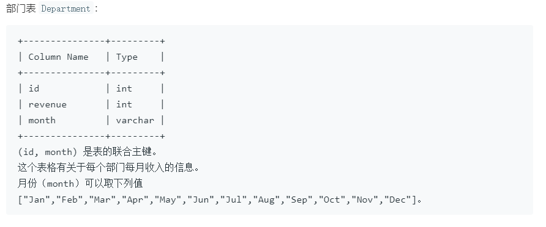
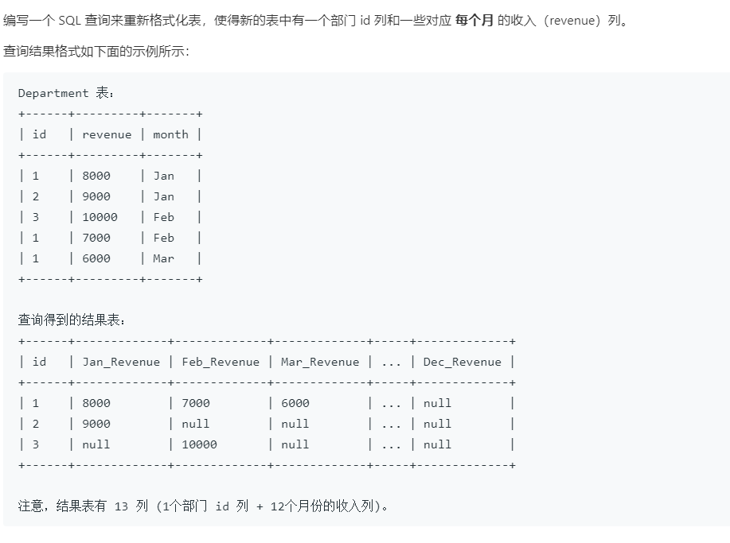

leetcode1179.重新格式化部门表

SQL架构

```sql
Create table If Not Exists Department (id int, revenue int, month varchar(5))
Truncate table Department
insert into Department (id, revenue, month) values ('1', '8000', 'Jan')
insert into Department (id, revenue, month) values ('2', '9000', 'Jan')
insert into Department (id, revenue, month) values ('3', '10000', 'Feb')
insert into Department (id, revenue, month) values ('1', '7000', 'Feb')
insert into Department (id, revenue, month) values ('1', '6000', 'Mar')
```





+ ①reven列根据month拆成行，方法 if(条件，条件成立的结果，条件不成立的结果)
+ ②相同id的行合并，方法select id,sum(1月),...,sum(12月) from table group by id，聚合函数为sum。

```sql
# Write your MySQL query statement below
select id,
sum(if(month='Jan',revenue,null)) Jan_Revenue,
sum(if(month='Feb',revenue,null)) Feb_Revenue,
sum(if(month='Mar',revenue,null)) Mar_Revenue,
sum(if(month='Apr',revenue,null)) Apr_Revenue,
sum(if(month='May',revenue,null)) May_Revenue,
sum(if(month='Jun',revenue,null)) Jun_Revenue,
sum(if(month='Jul',revenue,null)) Jul_Revenue,
sum(if(month='Aug',revenue,null)) Aug_Revenue,
sum(if(month='Sep',revenue,null)) Sep_Revenue,
sum(if(month='Oct',revenue,null)) Oct_Revenue,
sum(if(month='Nov',revenue,null)) Nov_Revenue,
sum(if(month='Dec',revenue,null)) Dec_Revenue
from Department
group by id;
```

