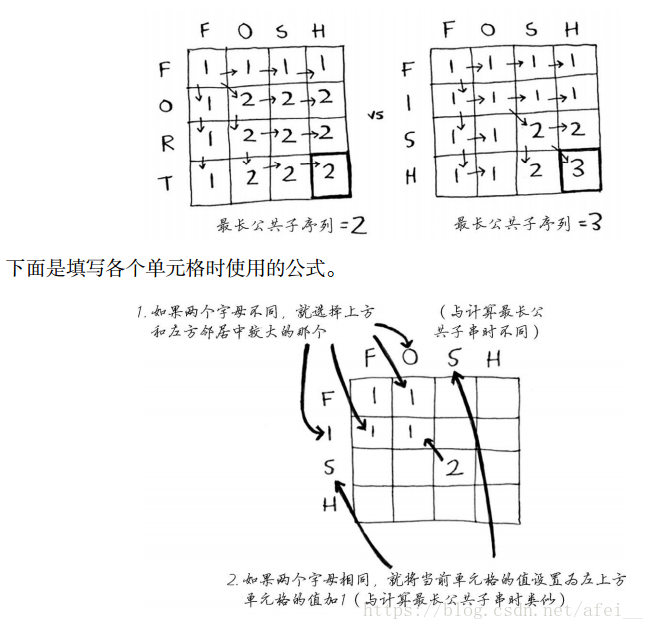
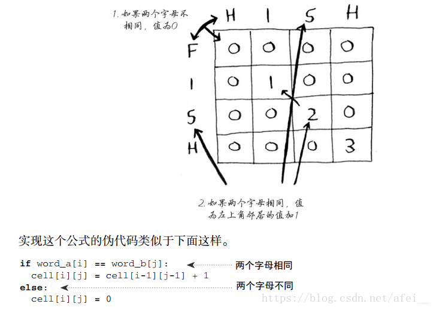

#### 1.构造回文(最长公共子序列LCS)

**题目描述**

给定一个字符串s，你可以从中删除一些字符，使得剩下的串是一个回文串。如何删除才能使得回文串最长呢？输出需要删除的字符个数。

##### **输入描述:**

```
输入数据有多组，每组包含一个字符串s，且保证:1<=s.length<=1000. 
```

##### **输出描述:**

```
对于每组数据，输出一个整数，代表最少需要删除的字符个数。
```

##### **输入例子1:**

```
abcda
google
```

##### **输出例子1:**

```
2
2
```

**思路**



**代码**

```java
import java.util.*;
public class Main{
    public static void main(String[] args){
        Scanner sc = new Scanner(System.in);
        while(sc.hasNext()){
            String s1 = sc.next();
            String s2 = new StringBuilder(s1).reverse().toString();
            int n = s1.length();
            int[][] dp = new int[n + 1][n + 1];
            for (int i = 1; i < n + 1; i ++){
                for (int j = 1; j < n + 1; j ++){
                    if(s1.charAt(i - 1) == s2.charAt(j - 1)){
                        dp[i][j] = dp[i - 1][j - 1] + 1;
                    }else{
                        dp[i][j] = Math.max(dp[i - 1][j], dp[i][j - 1]);
                    }
                }
            }
            System.out.println(n - dp[n][n]);
        }
    }
}
```

**拓展：最长公共子串**

给定两个序列 X 和 Y，如果 Z 即是 X 的子串，又是 Y 的子串，我们就称它是 X 和 Y 的公共子串，注意子串是连续的。例如 X = { A, B, C, D, E, F, G }，Y = { A, B, Z, D, E, F, K, G }，那么它们最长的公共子串即 { D, E, F }。

**思路**



```java
public class Main {
 
    public static void main(String[] args) {
        String s1 = "ABCDEFG";
        String s2 = "ABZDEFKG";
        System.out.println("最长公共子串长度：" + getLCS(s1, s2));
    }
 
    public static int getLCS(String s1, String s2) {
        char[] a = s1.toCharArray();
        char[] b = s2.toCharArray();
        // a.length行，b.length列
        int[][] result = new int[a.length + 1][b.length + 1];
        int max = 0;
        for (int i = 0; i < a.length; i++) {
            for (int j = 0; j < b.length; j++) {
                if (a[i] == b[j]) {
                    result[i + 1][j + 1] = result[i][j] + 1;
                    max = Math.max(max, result[i + 1][j + 1]);
                }
            }
        }
        return max;
    }
 
}

```

**2.字符移位-(冒泡)**

小Q最近遇到了一个难题：把一个字符串的大写字母放到字符串的后面，各个字符的相对位置不变，且不能申请额外的空间。(要求空间复杂度为O(1))

**输入描述:**

```
输入数据有多组，每组包含一个字符串s，且保证:1<=s.length<=1000.
```

##### **输出描述:**

```
对于每组数据，输出移位后的字符串。
```

##### **输入例子1:**

```
AkleBiCeilD
```

##### **输出例子1:**

```
kleieilABCD
```

**代码**

```java
import java.util.*;

public class Main {
    public static void main(String[] args) {
        Scanner sc = new Scanner(System.in);
        while (sc.hasNext()) {
            String s = sc.nextLine();
            char[] chars = s.toCharArray();
            for (int i = 0; i < s.length(); i++) {
                for (int j = 0; j < s.length() - i - 1; j++) {
                    if ((chars[j] >= 'A' && chars[j] <= 'Z') && (chars[j + 1] < 'A' || chars[j + 1] > 'Z')) {
                        char temp = chars[j];
                        chars[j] = chars[j + 1];
                        chars[j + 1] = temp;
                    }
                }
            }
            System.out.println(String.valueOf(chars));
        }
        sc.close();
    }
}
```

**3.最大最小差**

小Q今天在上厕所时想到了这个问题：有n个数，两两组成二元组，相差最小的有多少对呢？相差最大呢？

##### **输入描述:**

```
 输入包含多组测试数据。
 对于每组测试数据：
 N - 本组测试数据有n个数
 a1,a2...an - 需要计算的数据
 保证:
 1<=N<=100000,0<=ai<=INT_MAX.
  
```

##### **输出描述:**

```
对于每组数据，输出两个数，第一个数表示差最小的对数，第二个数表示差最大的对数。
```

##### **输入例子1:**

```
6
45 12 45 32 5 6
```

##### **输出例子1:**

```
1 2
```

**代码**

```java
import java.util.*;

public class Main {
    public static void main(String[] args) {
        Scanner sc = new Scanner(System.in);
        while (sc.hasNext()) {
            int n = sc.nextInt();
            int[] a = new int[n];
            for (int i = 0; i < n; i++) {
                a[i] = sc.nextInt();
            }
            // 1.先排序
            Arrays.sort(a);
            // 特殊情况，所有数都相同，差最大对数=差最小对数=(n*(n-1))/2。
            if (a[0] == a[n - 1]) {
                int res = (n * (n - 1)) / 2;
                System.out.println(res + " " + res);
                continue;
            }
            
            // 2.使用TreeMap(有序map)存储中每种数字的数量
            Map<Integer, Integer> map = new TreeMap<>();
            for (int i = 0; i < n; i++) {
                if (map.containsKey(a[i])) {
                    map.put(a[i], map.get(a[i]) + 1);
                } else {
                    map.put(a[i], 1);
                }
            }

            // 3.计算差最小的数量minres
            int minres = 0;
            // 3.1如果数组中没有重复数字，说明最小差不为0，最小差是数组中相邻两个数的差，遍历一边数组，计算并统计最小差。
            if (map.size() == n) {
                int min = Math.abs(a[1] - a[0]);
                minres = 1;
                for (int i = 2; i < n; i++) {
                    int tmp = Math.abs(a[i] - a[i - 1]);
                    if (tmp == min) {
                        minres++;
                    } else if (tmp < min) {
                        min = tmp;
                        minres = 1;
                    }
                }
            } else {
                // 3.2如果数组中有重复数字，说明最小差是0，此时遍历一边map，value不为0的数字产生最小最小差0，使用公式计算。
                for (Integer key : map.keySet()) {
                    int val = map.get(key);
                    if (val > 1) {
                        minres = minres + (val * (val - 1)) / 2;
                    }
                }
            }

            // 4.计算最大差个数
            // 只有一种情况，最大查对数=最大值个数*最小值个数
            int maxres = 0;
            List<Integer> keyset = new ArrayList<>(map.keySet());
            int val1 = map.get(keyset.get(0));
            int val2 = map.get(keyset.get(keyset.size() - 1));
            maxres = val1 * val2;

            System.out.println(minres + " " + maxres);
        }
        sc.close();
    }
}
```